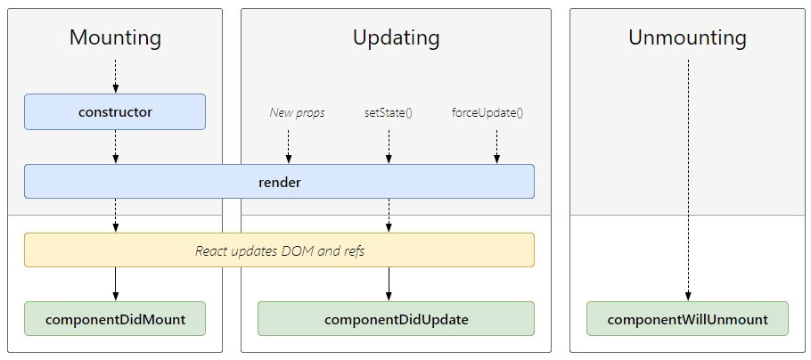

# react-lifecycle methods

```
React lifecycle methods as the series of events that happen from the birth of a React component to its death.

```

Every component in React goes through a lifecycle of events. I like to think of them as going through a cycle of birth, growth, and death.

- Mounting – Birth of your component
- Update – Growth of your component
- Unmount – Death of your component

As everything goes through a cycle of taking birth, growing, and death the same goes with React. Each component in React has a lifecycle that goes through three main phases Mounting, Updating, and Unmounting.

The react lifecycle method is used in the React class component. It helps us in creating our state and mutating them.




## Common React Lifecycle Methods

### Mounting

The mounting means to put elements into the DOM. React uses virtual DOM to put all the elements into the memory. It has four built-in methods to mount a component namely

1. constructor()
2. getDerivedStateFromProps()
3. render()
4. componentDidMount()

### 1. constructor()

**constructor** method is called when the component is initiated and it’s the best place to initialize our state. The constructor method takes **props** as an argument and starts by calling **super(props)** before anything else. See src/components/Counter.js

```
    class Cunstructor extends React.Component {
        constructor(props) {
            super(props);
            this.state = {
            name: "cunstructor() method example"
            };
        }
        render() {
            return (
            <div>
                <h4> 1. This is a {this.state.name}</h4>
            </div>
            );
        }
    }
```

Here **name** is our initial state inside our constructor method and then we are calling our initial state to **render** method using **this.state.name**. The following code will output `This is a Constructor Method` .

### 2. getDerivedStateFromProps()

This is one of the newer lifecycle methods introduced very recently by the React team.

This will be a safer alternative to the previous lifecycle method **componentWillReceiveProps()**.

It is called right before rendering the element in our DOM. It takes props and state as an argument and returns an object with changes to the state.

getDerivedStateFromProps is a static function and like the **render** function getDerivedStateFromProps is meant to be **pure**.

This is a static function that does not have access to “this“. getDerivedStateFromProps() returns an object to update state in response to prop changes. It can return a null if there is no change to state.

This method also exists only for rare use cases where the state depends on changes in props in a component

```
    class ChildComponenet extends React.Component {
        constructor(props) {
            super(props);
            this.state = {
                name: "Constructor Method 1"
            }
        }

        static getDerivedStateFromProps(props, state) {
            return {name: props.nameFromParent}
        }

        render() {
            return (
                <div>
                    <h4>{this.state.name}</h4>
                </div>
            )
        }
    }

    class GetDerivedStateFromPropsMethod extends React.Component {
        render() {
            return (
                <div>
                    <ChildComponenet nameFromParent = "9.Name from getDerivedStateFromProps Method" />
                </div>
            )
        }
    }
```

### 3. render()

The render() method is the most used lifecycle method. You will see it in all React classes. This is because render() is the only required method within a class component in React.

As the name suggests it handles the rendering of your component to the UI. It happens during the mounting and updating of your component.

```
    class Hello extends Component{
        render(){
            return <div>Hello {this.props.name}</div>
        }
    }
```

As you can see in the example above, the render() method returns JSX that is displayed in the UI. A render() can also return a null if there is nothing to render for that component.

##### A _render()_ method has to be pure with no side-effects.

React requires that your render() is pure. Pure functions are those that do not have any side-effects and will always return the same output when the same inputs are passed. This means that you can not setState() within a render().

```
    You cannot modify the component state within the render().
```

If you do need to modify state that would have to happen in the other lifecycle methods, therefore keeping render() pure.

### 4. componentDidMount()

Now your component has been mounted and ready, that’s when the next React lifecycle method _componentDidMount()_ comes in play.

The most common and widely used lifecycle method is **componentDidMount**. This method is called after the component is rendered. You can also use this method to call external data from the API.

Unlike the render() method, componentDidMount() allows the use of setState(). Calling the setState() here will update state and cause another rendering but it will happen before the browser updates the UI. This is to ensure that the user will not see any UI updates with the double rendering.

```
  You can modify the component state within the componentDidMount(), but use it with caution.
```

**Caution** : It is recommended that you use this pattern with caution since it could lead to performance issues. The best practice is to ensure that your states are assigned in the constructor(). The reason React allows the setState() within this lifecycle method is for special cases like tooltips, modals, and similar concepts when you would need to measure a DOM node before rendering something that depends on its position.

#### Example 1.

```
    class DidMountMethod extends React.Component {
        constructor(props) {
            super(props);
            this.state = {
            name: "This name will change after 5 secs"
            };
        }
        componentDidMount() {
            setTimeout(() => {
            this.setState({ name: "5.This is a componentDidMount Method" });
            }, 5000);
        }
        render() {
            return (
            <div>
                <h3>{this.state.name}</h3>
            </div>
            );
        }
    }
```

` This example will print This is a componentDidMount Method after 5 sec. This proves that the method is called after the component is rendered.`

#### Example 2 Calling Data from API

```
    class FetchWithDidMountMethod extends React.Component {
        constructor(props) {
            super(props);
            this.state = {
                users: [],
                loading: false
            }
        }
        componentDidMount() {
            // fetch('https://jsonplaceholder.typicode.com/users').then(res => res.json()).then(data => this.setState({users: data}))
            axios.get('https://jsonplaceholder.typicode.com/users').then(response => {
                this.setState({users: response.data, loading: true})
            })

        }
        render() {
            const {users, loading} = this.state
            return (
                <div>
                    <h3>6. Make Fetch API call in componentDidMount lifecycle method</h3>
                    <p>This will print all the name available in API users data</p>
                    {loading ? users.map(user=> <h6 key={user.id}>{user.name}</h6>) : '....'}

                </div>
            )
        }
    }
```

In the above example, I have first initialized data as a blank array after that I have used the Javascript fetch method to load data from the API inside our componentDidMount method and then changed our data state using the React setState method from blank array to the data we are receiving from the API. Then we have used the javascript map function to iterate our data and print all users’ names from the API.

## Uncommon React Lifecycle Methods

### Updating

This is the second phase of the React lifecycle. A component is updated when there is a change in state and props React and basically has five built-in methods that are called while updating the components.

1. getDerivedStateFromProps()
2. shouldComponentUpdate()
3. render() `This is comes in common React lifecycle method`
4. getSnapshotBeforeUpdate()
5. componentDidUpdate() `This is comes in common React lifecycle method`

We have already discussed `getDerivedStateFromProps() and render()` a method so now let us discuss the remaining methods.

#### 2. shouldComponentUpdate()

This lifecycle can be handy sometimes when you don’t want React to render your state or prop changes. Anytime setState() is called, the component re-renders by default.

The _shouldComponentUpdate()_ method is used to let React know if a component is not affected by the state and prop changes.

This lifecycle method is used when you want your state or props to update or not. This method returns a boolean value that specifies whether rendering should be done or not. The default value is true.

Keep in mind that this lifecycle method should be sparingly used, and it exists only for certain performance optimizations. You cannot update component state in shouldComponentUpdate() lifecycle.

##### Example

```
    class ShouldUpdateMethod extends React.Component {
        constructor(props){
            super(props)
            this.state = {
                name: 'shouldComponentUpdate Method'
            }
        }
        shouldComponentUpdate() {
            return false; //Change to true for state to update
        }

        componentDidMount(){
            setTimeout(() => {
                this.setState({name: "componentDidMount Method"})
            }, 5000)
        }
        render() {
            return (
                <div>
                <h4>10. This is a {this.state.name}</h4>
                </div>
            );
        }
    }
```

In the above example, you will notice that first I have initialized the name state inside the constructor method and after that changed state using setState inside componentDidMount method. So basically the name state should be changed from `shouldComponentUpdate Method` to `componentDidMount Method` after 5 seconds but it didn’t change because of shouldComponentUpdate set to false, If you change that true the state will be updated.

#### 4.getSnapshotBeforeUpdate()

getSnapshotBeforeUpdate() is another new lifecycle method introduced in React recently. This will be a safer alternative to the previous lifecycle method componentWillUpdate().

This method is called right before updating the DOM. It has access to props and state before the update. Here you can check what was the value of your props or state before its update. So let see how it works.

`Note : componentDidUpdate() should be included otherwise you will get an error`

It is called right before the DOM is updated. The value that is returned from getSnapshotBeforeUpdate() is passed on to componentDidUpdate().

Keep in mind that this method should also be used rarely or not used at all.

Resizing the window during an async rendering is a good use-case of when the getSnapshotBeforeUpdate() can be utilized.

##### Example

```
    class GetSnapshotBeforeUpdateMethod extends React.Component {
        constructor(props){
            super(props)
            this.state = {
            name: 'constructor Method'
            }
        }

        componentDidMount(){
            setTimeout(() => {
            this.setState({name: "componentDidMount Method"})
            }, 5000)
        }
        getSnapshotBeforeUpdate(prevProps, prevState) {
            document.getElementById('previous-state').innerHTML = "The previous state was " + prevState.name
        }
        componentDidUpdate() {
            document.getElementById('current-state').innerHTML = "The current state is " + this.state.name
        }
        render() {
            return (
                <>
                <h5>11.This is a {this.state.name}</h5>
                    <p id="current-state"></p>
                    <p id="previous-state"></p>
                </>
            )
        }
    }
```

In the above example, we initialized our name state as constructor Method after that changed that using setState in componentDidMount method to componentDidMount Method . So my previous state was constructor Method and the current state is componentDidMount Method So now I can get my previous State from the getSnapshotBeforeUpdate method. So using the getSnapshotBeforeUpdate method I have printed my previous state to our DOM using document.getElementById(‘previous-state’).innerHTML = “The previous state was “ + prevState.name.

#### 5. componentDidUpdate()

This lifecycle method is invoked as soon as the updating happens. The most common use case for the componentDidUpdate() method is updating the DOM in response to prop or state changes.

The componentDidUpdate method is called after the component is updated in the DOM. This is the best place in updating the DOM in response to the change of props and state

You can call setState() in this lifecycle, but keep in mind that you will need to wrap it in a condition to check for state or prop changes from previous state. Incorrect usage of setState() can lead to an infinite loop.

This method provides the previous props and state values. This way it allows you to do a comparison of a before and current snapshot.

`componentDidUpdate` is always the last lifecycle to get called for a React component.

`componentDidUpdate` does not get called after the first initial render() lifecycle.

```

```

```
  You can modify the component state within the componentDidUpdate(), but use it with caution.

  Syntax:

    componentDidUpdate(prevProps, prevState, snapshot)

```

##### Example

```
    class DidUpdateMethod extends React.Component {
        constructor(props) {
            super(props);
            this.state = {
                name: 'from previous state'
            }
        }
        componentDidMount() {
            setTimeout(() => {
                this.setState({
                    name: 'to current state'
                })
            }, 5000)
        }
        componentDidUpdate(prevState) {
            if(prevState.name !== this.state.name) {
                document.getElementById('statechange').innerHTML = "7.Yes the state is changed"
                // this.setState({
                //     name: 'Yes the state is changed'
                // })
            }
        }
        render() {
            return (
                <div>
                    <h3 id="statechange"> State was changed {this.state.name}</h3>
                </div>
            )
        }
    }
```

In the above example, our initial name state was `from previous state` and after that using setState, I have set the name state to `to current state`. So React will render the name state from `State was changed from previous state to State was changed to current state` after 5 seconds. Using the conditional checking of the current state with the previous state `prevState.name !== this.state.name` inside the componentDidUpdate method, we are updating the value of the id `statechange` to Yes the state is changed .

This method is best use for:

- DOM manipulation after the component has rendered
- API calls after specific conditions have been met
- Update React state or stores like Redux, and Mobx after a set of conditions have been met

### Unmounting

The final or the end of the react lifecycle is Unmounting. This is used when a component is removed from the DOM. React has only one built-in method that gets called when a component is unmounted

1.componentWillUnmount()

#### componentWillUnmount()

If there are any cleanup actions like canceling API calls or clearing any caches in storage you can perform that in the componentWillUnmount method. You cannot use setState inside this method as the component will never be re-rendered.

As the name suggests this lifecycle method is called just before the component is unmounted and destroyed. If there are any cleanup actions that you would need to do, this would be the right spot.

```
    You cannot modify the component state in componentWillUnmount lifecycle.
```

### Summary

- The constructor() method is the best place to initialize our state
- The getDerivedStateFromProps() is a rarely used lifecycle method and is the best place to set the state object based on the initial props.
- The shouldComponentUpdate() specifies whether React should continue with the rendering or not.
- The render() method is the most used and compulsory lifecycle method.
- The getSnapshotBeforeUpdate() method has access to the props and state even after the update.
- The componentDidMount() is the most common and widely used lifecycle method and is called after the component is rendered. You can also use this method to call external data from the API.
- The componentDidUpdate() method is called after the component is updated in the DOM and is the best place in updating the DOM in response to the change of props and state.
- The componentWillUnmount() happens just before the component unmounts and is destroyed and is used for cleanup actions like canceling API calls.
